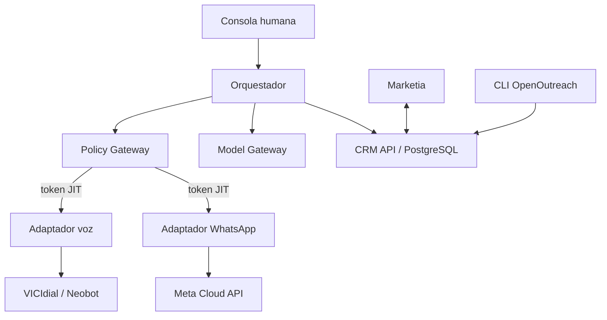

# Arquitectura implementada

## Flujo controlado

El canal no recibe una orden ejecutable hasta que Policy Gateway evalúa evidencia actual y firma un token ligado a tenant, contacto, campaña, propósito, canal y hash del contenido. El adaptador consume el `jti` atómicamente; el replay falla.

## Separación de licencias

- `services/*` son unidades propietarias separables en repositorios e imágenes independientes.
- `shared/atlantis_contracts` contiene sólo contratos y utilidades neutrales. Antes de publicación debe asignarse una licencia OSI permisiva y generar sus avisos.
- `outreach_cli.py` usa `subprocess` con `shell=False`; no hay import, enlace ni copia de OpenOutreach.
- Node-RED no es autoridad y sólo existe bajo el perfil auxiliar de laboratorio.
- No se incluye n8n, Evolution API, VICIdial, OpenOutreach, LangGraph ni pesos de modelos en este paquete fuente.

## Persistencia

`database/001_schema.sql` y `002_hardening.sql` son la base productiva: aislamiento por tenant, RLS forzado, outbox/inbox, decisiones, tokens, snapshots REPEP, checkpoints, acciones humanas y auditoría append-only. `CRMStore` y `InMemoryReplayLedger` son dobles de prueba; no deben habilitarse en producción.

## Integración LangGraph

`langgraph_adapter.py` constituye el único punto de importación. Se activa sólo después de fijar la versión/licencia en el lock aprobado. El motor determinístico implementado sirve para simulación, replay y pruebas de invariantes, pero no sustituye un checkpointer PostgreSQL de producción.

## Amenazas cubiertas en el incremento

| Amenaza | Control implementado |
|---|---|
| Marcación sin autorización | Token JIT, audiencia y claims exactos |
| Replay | Ledger de consumo único |
| REPEP activo caído/ambiguo o excepción B2B incompleta | Denegación fail-closed |
| Cambio tras aprobación | Comparación de hash e invalidación |
| Opt-in ausente | Denegación WhatsApp |
| Marketia habilita contacto | Campos protegidos rechazados |
| Modelo ejecuta acción | SalesGPT sólo recomienda |
| Fuga básica de PII | Redacción antes de proveedor |
| Reintento duplicado | Evento procesado + idempotency key |
| Contaminación GPL | Gate de imports y proceso externo |

Pendientes antes de producción: identidad OIDC/mTLS, secretos KMS/Vault, ledger JIT PostgreSQL atómico, llamadas a proveedores reales, verificación de webhooks, OTel, RabbitMQ, SAST/DAST/SCA, pentest, load test y DR.

## Proveedores de modelos externos

El Model Gateway admite `openrouter`, `kimi` y `deepseek` en el orden definido
por `ATLANTIS_MODEL_PROVIDER_ORDER`. OpenRouter se comunica directamente con el
endpoint HTTPS oficial, recibe la clave sólo mediante Docker secret y exige un
`OPENROUTER_MODEL_ID` explícito. La ruta nunca entrega secretos al modelo y
continúa aplicando redacción, presupuesto, salida JSON y fallback. La clase
`RESTRICTED` no puede salir por OpenRouter hasta agregar `openrouter` a
`RESTRICTED_PROVIDER_ALLOWLIST` mediante aprobación formal.
