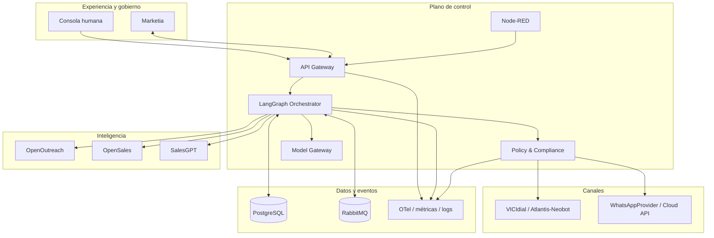
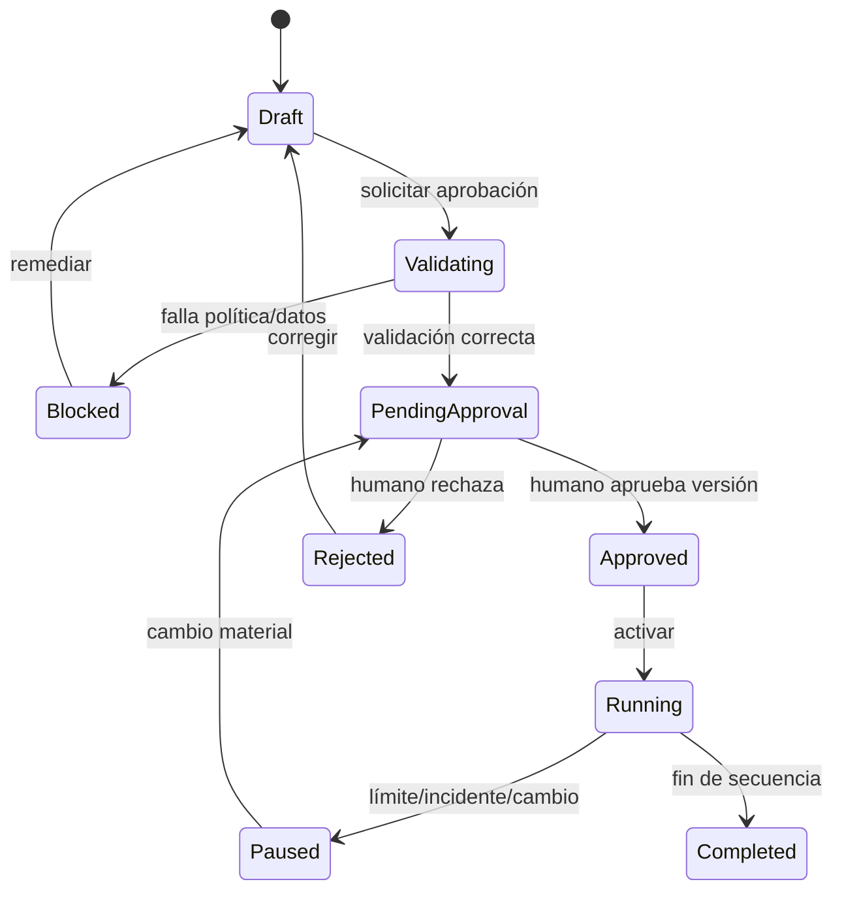

# Diseño técnico

## 1. Arquitectura objetivo



### Límites de confianza

- **Modelos y agentes:** no reciben credenciales de canal ni acceso SQL libre; sólo herramientas con esquema, alcance y autorización.
- **Canales:** sólo aceptan comandos firmados por el Policy Gateway. En voz, la verificación vive también en el punto real de `originate/dial`, no sólo al importar leads.
- **Fuentes externas:** todo contenido se considera no confiable y se normaliza, etiqueta y escanea contra prompt injection.
- **Servicios propietarios:** Atlantis-Neobot, Marketia, Policy Gateway, CRM API y cada adaptador viven en repositorios/artefactos e imágenes separados; se comunican por API/eventos y no se enlazan con código copyleft.
- **Marketia:** es un servicio propietario colaborador, no la autoridad de consentimiento ni cumplimiento.
- **PostgreSQL:** autoridad para estado comercial, consentimiento, exclusiones, aprobaciones y auditoría; claves compuestas y RLS impiden referencias entre tenants.
- **OSS externo:** OpenOutreach se ejecuta sin modificar como proceso/CLI externo por GPLv3, con intercambio de archivos o `stdin/stdout`/API de proceso. No se importa como librería. Si se distribuye un fork modificado, se entrega su fuente GPLv3. OpenSales y SalesGPT no conservan credenciales ni herramientas de envío o pago.
- **Automatización visual:** Node-RED core Apache-2.0 sustituye n8n. Se ejecuta en contenedor independiente, no es autoridad del flujo comercial y sólo invoca endpoints allowlist. Cada nodo adicional se somete al gate de licencias.

## 2. Flujo de campaña



Una aprobación se liga a un manifiesto canónico que contiene `campaign_version_id`, contenido exacto por canal, segmento materializado o consulta versionada, propósito, canales, horarios, límites, conocimiento, prompts y reglas. El hash se calcula sobre JSON canónico. Cambiar cualquiera de esos elementos crea una nueva versión y revoca la autorización de ejecución.

## 3. Flujo de una acción saliente

1. LangGraph crea `action_intent` con tenant, contacto, campaña, propósito, canal y contenido hash.
2. Policy Gateway verifica tenant, estado de campaña, aprobación, DNC interno, consentimiento/base jurídica, horario, frecuencia y límites.
3. Para voz promocional evalúa la configuración de campaña. Si REPEP está activo,
   consulta el snapshot autorizado con lote, fecha efectiva, recibo/contrato, hash
   y vigencia; si falta, está vencido o es ambiguo, deniega. Si está inactivo,
   exige excepción B2B aprobada y evidencia jurídica; en caso contrario, deniega.
4. Para WhatsApp promocional exige opt-in verificable y cumplimiento de plantilla/ventana conversacional.
5. Cuando un worker retira la acción para ejecución, repite la evaluación y emite `outbound_authorization` justo a tiempo, firmado, de un solo uso y TTL máximo 5 minutos.
6. El adaptador valida firma, audiencia, tenant, contacto, campaña, hash, TTL y no-reutilización. VICIdial/Asterisk vuelve a validar en el punto exacto de `originate/dial`.
7. El resultado entra por webhook firmado, se deduplica, persiste y reanuda el grafo.

## 4. Máquina LangGraph

Estado mínimo `SalesRunState`:

```json
{
  "tenant_id": "uuid",
  "run_id": "uuid",
  "campaign_version_id": "uuid",
  "contact_id": "uuid",
  "stage": "QUALIFY|PREPARE|APPROVE|CONTACT|CONVERSE|HANDOFF|CLOSE",
  "facts": [],
  "policy_decision_id": "uuid|null",
  "pending_human_action_id": "uuid|null",
  "attempts": {},
  "last_event_id": "uuid",
  "next_action": {},
  "schema_version": 1,
  "workflow_version": "sales-graph@1"
}
```

Nodos: `discover → enrich → qualify → segment → personalize → preflight → campaign_approval → contactability_check → channel_dispatch → observe_reply → classify_intent → converse → sensitive_gate → handoff_or_close → sync_marketia → finish`.

Los nodos son idempotentes. Los efectos externos se ejecutan mediante outbox. Los errores transitorios usan backoff exponencial con jitter; los permanentes terminan en cola de revisión. Una interrupción humana conserva checkpoint y fecha límite. Cada checkpoint fija `workflow_version`; una ejecución se reanuda con el mismo artefacto de grafo o mediante una migración probada. Nunca se reintenta automáticamente una denegación de política.

## 5. Propiedad de componentes

| Capacidad | Propietario lógico | Restricción |
|---|---|---|
| Descubrimiento/enriquecimiento | OpenOutreach adapter | Guardar fuente, licencia, timestamp y confianza. |
| Segmentación/secuencia/personalización | OpenSales adapter | No puede enviar; produce artefactos versionados. |
| Diálogo/objeciones | SalesGPT adapter | No puede ejecutar herramientas de canal directamente. |
| Estado y compensación | LangGraph | Checkpointer Postgres; no duplica el CRM. |
| Decisión de contacto | Policy Gateway | Código determinista, políticas versionadas y evidencia. |
| Ejecución de voz | Voice adapter | Requiere token de autorización. |
| Ejecución WhatsApp | WhatsAppProvider | Cloud API directa preferida; Evolution opcional sólo con transporte oficial y licencia aprobada. |
| Campañas/atribución propia | Marketia adapter | Sync bidireccional con propiedad explícita de campos. |
| Registro | PostgreSQL | RLS por tenant y auditoría append-only. |
| Automatización auxiliar | Node-RED service | Sólo flujos administrativos autorizados; sin bypass de LangGraph/Policy; core y nodos fijados y aprobados. |

### 5.1 Límites de propiedad y compilación

- `atlantis-neobot`, `marketia`, `policy-gateway`, `crm-api` y cada `*-adapter` SHALL producir una imagen propietaria independiente con SBOM propio.
- Ninguno de esos servicios SHALL importar paquetes, copiar archivos, enlazar librerías ni compartir proceso con OpenOutreach o componentes GPL/AGPL.
- OpenOutreach SHALL ejecutarse desde una imagen/proceso externo sin modificaciones. La integración propietaria SHALL limitarse a un contrato de datos versionado y validado.
- Los volúmenes compartidos SHALL contener únicamente entradas/salidas de datos; nunca código, módulos cargables ni plugins cruzando el límite de licencia.

## 6. Gateway de modelos

Interfaz estable:

```text
generate(task_type, messages, response_schema, data_classification,
         quality_tier, latency_budget_ms, max_cost, tenant_policy) -> ModelResult
```

El registro de capacidades mantiene alias (`reasoning-premium`, `conversation-balanced`, `classification-low-cost`) separados de IDs de proveedor. Kimi K3 y DeepSeek se configuran por despliegue. La ruta considera residencia/privacidad, términos de tratamiento, JSON/tool calling, latencia, costo, salud y límite. Un circuit breaker abre tras fallos y cambia al proveedor permitido. En una conversación activa el proveedor queda fijado salvo fallback auditado; todo cambio pasa evals y canary. La caché sólo admite contenido no sensible o hash seguro.

Todas las salidas de acción se validan contra JSON Schema. Fallo de esquema: una reparación; luego fallback; luego revisión humana. El sistema conserva metadatos, no razonamiento interno del proveedor.

## 7. Modelo de aprobación humana

Roles: `campaign_owner`, `sales_manager`, `compliance_reviewer`, `sensitive_deal_approver`, `auditor`, `platform_admin`. No hay autoaprobación: creador y aprobador deben ser distintos para campañas de riesgo alto.

Se requiere revisión humana para:

- primera activación y todo cambio material de campaña;
- contacto a segmentos o industrias sensibles configuradas;
- quejas, amenazas legales, solicitud de borrado o revocación;
- descuento, devolución, crédito o concesión mayor al umbral;
- afirmaciones no presentes en la base aprobada;
- términos contractuales, firma, pago o link de cobro;
- identidad/intención incierta, menores o datos altamente sensibles;
- puntuación de confianza menor al umbral.

## 8. Datos, memoria y retención

- Memoria factual separada de transcripciones; cada hecho tiene fuente, confianza, vigencia y clasificación.
- Resúmenes nunca sustituyen la evidencia original.
- PII cifrada en tránsito y reposo; campos de alta sensibilidad con cifrado de aplicación.
- RLS exige `tenant_id`; trabajos internos usan cuentas dedicadas, no superusuario.
- Retención configurable por tipo; expiración mediante trabajos auditados; legal hold impide borrado.
- Grabaciones se almacenan fuera de PostgreSQL; la base sólo conserva URI firmable, hash, consentimiento/aviso y metadatos.

## 9. Eventos e idempotencia

Formato CloudEvents compatible: `event_id`, `event_type`, `occurred_at`, `tenant_id`, `aggregate_id`, `aggregate_version`, `correlation_id`, `causation_id`, `payload_schema_version`.

Productores escriben negocio + outbox en una transacción. Consumidores registran inbox antes de aplicar. Webhooks exigen firma, ventana temporal y clave de deduplicación. Ordenamiento por agregado; eventos fuera de orden se retienen y reconcilian.

## 10. Seguridad

- OIDC/OAuth2 para humanos; workload identity/mTLS para servicios.
- RBAC + atributos de tenant, región y sensibilidad.
- Secretos en gestor dedicado, rotación y nunca en prompts/logs.
- Egress allowlist por adaptador; SSRF y URLs no confiables bloqueadas.
- Sanitización de HTML, URLs y documentos; herramientas con mínimos privilegios.
- SAST, DAST, escaneo de dependencias, SBOM y revisión de licencias antes de releases.
- El release manifest fija `repository`, `tag`, `commit`, `image`, `digest`, `license_spdx`, hash del texto de licencia y, para modelos, `model_id`, revisión y licencia. Alias mutables y `latest` están prohibidos.
- Una entrega de appliance/VM/plantilla/ISO exige un bundle reproducible con SBOM CycloneDX/SPDX, `THIRD_PARTY_NOTICES`, textos de licencia, oferta o paquete de código fuente correspondiente, scripts de build/instalación y hashes.
- Logs estructurados con redacción; exportación inmutable de eventos de auditoría.

## 11. SLO y capacidad inicial

| Área | Objetivo |
|---|---|
| API/control plane | 99.9% mensual |
| Decisión de política con evidencia local | p95 < 300 ms |
| ACK de webhook | p95 < 2 s |
| RPO / RTO | 15 min / 4 h |
| Escala inicial | 1 M contactos/tenant, 100 grafos concurrentes, 100 webhooks/s |
| Auditoría | 100% acciones externas correlacionadas |

## 12. Decisiones y alternativas

1. **Gateway central vs controles duplicados:** central para consistencia; los adaptadores conservan un segundo bloqueo defensivo.
2. **Cloud API directa vs Evolution/Baileys:** adaptador directo a Cloud API como ruta preferida; Evolution es opcional con transporte oficial y licencia aprobada; Baileys sólo laboratorio.
3. **PostgreSQL como registro vs CRM repartido:** PostgreSQL es autoridad; Marketia y canales son proyecciones reconciliables.
4. **RabbitMQ + outbox:** desacopla canales; outbox evita pérdida entre transacción y publicación.
5. **Adaptadores vs forks profundos:** adaptadores limitan dependencia de APIs/licencias cambiantes.
6. **Node-RED vs n8n:** Node-RED core se selecciona por Apache-2.0; n8n queda excluido. Los nodos de terceros no heredan aprobación automática.
7. **Entrega instalada vs appliance:** SaaS interno puede promoverse con el gate de runtime; cualquier VM/ISO/appliance activa además el gate de distribución y fuentes.

## 13. Preguntas abiertas bloqueantes

- ¿Qué endpoints/webhooks ofrece Marketia y qué campos controla?
- ¿Atlantis-Neobot inicia llamadas o sólo gestiona bot/medios?
- ¿Qué mecanismo autorizado de REPEP tendrá la organización y cuál es su SLA?
- ¿Cuál será la periodicidad jurídicamente válida de los snapshots REPEP y qué registros sectoriales adicionales aplican?
- ¿Cuáles son países, horarios, productos regulados y umbrales monetarios?
- ¿Qué proveedor de identidad, secretos, objetos, métricas y colas se usará?
- ¿Qué versiones/licencias exactas se aprobarán y qué componentes deberán ejecutarse como servicios aislados?
